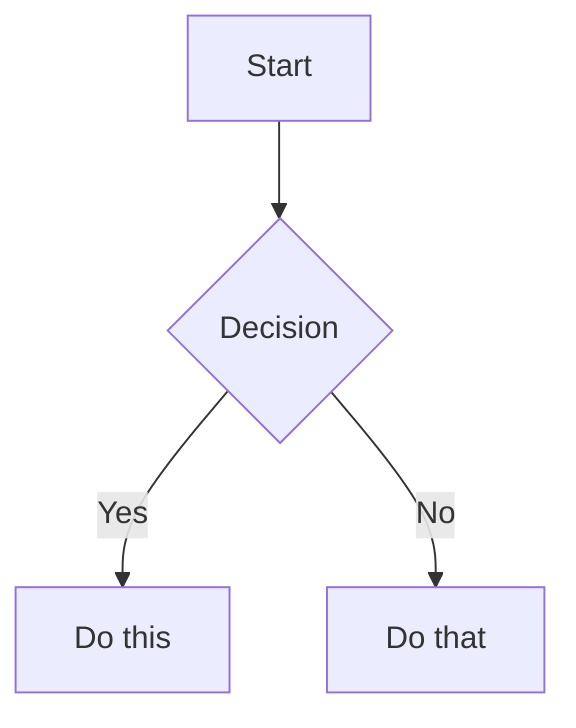

# CLAUDE.md

This file provides guidance to Claude Code (claude.ai/code) when working with code in this repository.

## Essential Commands

```bash
# Development
npm start           # Start development server at http://localhost:3000
npm run build       # Build for production (outputs to ./build/)
npm run serve       # Serve built site locally
npm run typecheck   # Run TypeScript type checking

# Content Management
npm run clear             # Clear Docusaurus cache
npm run write-translations  # Generate translation files
npm run write-heading-ids   # Add heading IDs for markdown

# Legacy yarn commands (from README.md)
yarn start          # Alternative to npm start
yarn build          # Alternative to npm run build
```

## Architecture Overview

This is a **personal GitHub Pages site** (wcygan.github.io) built with **Docusaurus 3.8.1 + TypeScript**, following a specific configuration pattern for personal pages deployment.

### Core Configuration Pattern

**Critical**: This site uses `baseUrl: '/'` in `docusaurus.config.ts` because it's a **personal GitHub Pages site** (username.github.io), not a project site. This is different from typical Docusaurus deployments that use `baseUrl: '/project-name/'`.

Key configuration in `docusaurus.config.ts`:
```typescript
url: 'https://wcygan.github.io',
baseUrl: '/',  // MUST be '/' for personal pages
organizationName: 'wcygan',
projectName: 'wcygan.github.io',
trailingSlash: false,
```

### Deployment Architecture

**GitHub Actions Deployment**: Uses modern 2024-2025 workflow pattern with separate build/deploy jobs:
- `.github/workflows/deploy.yml` - Production deployment (triggers on main branch push)
- `.github/workflows/test-deploy.yml` - PR testing (build validation only)

**Action versions**: configure-pages@v5, upload-pages-artifact@v3, deploy-pages@v4 (future-proofed for 2025 deprecations)

### Content Structure

```
docs/           # Documentation pages (sidebars.ts controls navigation)
blog/           # Blog posts with authors.yml and tags.yml
src/pages/      # Custom React pages (index.tsx = homepage)
src/components/ # Reusable React components
static/         # Static assets (contains .nojekyll for GitHub Pages)
```

**Important**: `static/.nojekyll` file prevents Jekyll processing on GitHub Pages - required for Docusaurus deployment.

### TypeScript Integration

- Full TypeScript support with `tsconfig.json` extending `@docusaurus/tsconfig`
- Config file is `docusaurus.config.ts` (not .js)
- All React components use `.tsx` extensions
- Type checking available via `npm run typecheck`

## Development Notes

**Node.js Requirement**: Requires Node.js 18+ (specified in package.json engines)

**Content Editing**: 
- Docs use MDX format with edit links pointing to GitHub repo
- Blog posts support MDX with author attribution system
- Homepage customization via `src/pages/index.tsx` and `src/components/HomepageFeatures/`

**Styling**: Uses CSS modules pattern (`styles.module.css`) with custom CSS in `src/css/custom.css`

## Mermaid Diagrams

**Configuration**: Mermaid diagrams are supported via `@docusaurus/theme-mermaid` package.

**Setup Requirements**:
1. Package installed: `@docusaurus/theme-mermaid@3.8.1`
2. Configuration in `docusaurus.config.ts`:
   ```typescript
   themes: ['@docusaurus/theme-mermaid'],
   markdown: {
     mermaid: true,
   },
   ```

**Usage in Markdown**:
```markdown

```

**Supported Diagram Types**: Flowchart, Sequence, Gantt, Class, State, Entity Relationship, User Journey, Pie Chart, Requirement, Gitgraph, Mindmap, Quadrant Chart, Architecture

**Important Notes**:
- Clear cache (`npm run clear`) and restart dev server after adding Mermaid configuration
- Some diagram types (e.g., mindmap) may have rendering issues
- Diagrams support theme customization via directives: `%%{init: { "theme": "forest" } }%%`

## Browser Testing with Puppeteer MCP

**Automated Browser Testing**: Use Puppeteer MCP for testing the site during development:

```bash
# After starting the dev server
yarn start  # or npm start

# Use Puppeteer MCP tools in Claude Code:
mcp__puppeteer__puppeteer_navigate --url "http://localhost:3000/"
mcp__puppeteer__puppeteer_screenshot --name "homepage-test"
mcp__puppeteer__puppeteer_click --selector "a[href='/docs/intro']"
mcp__puppeteer__puppeteer_evaluate --script "document.title"
```

**Common Testing Scenarios**:
- Navigation testing: Click through docs sidebar, verify breadcrumbs
- Dark mode toggle: Test theme switching functionality
- Responsive design: Capture screenshots at different viewport sizes
- Search functionality: Test Algolia DocSearch integration
- Interactive elements: Verify code block copy buttons, tabs
- Mermaid diagrams: Verify diagram rendering and SVG generation

**Testing Tips**:
- The site runs on `http://localhost:3000/` in development
- Use CSS selectors for navigation links: `a[href="/docs/intro"]`
- Dark mode toggle: `button[aria-label*="dark"]`
- Capture screenshots to verify visual changes
- Use `puppeteer_evaluate` to check JavaScript state and console errors
- For Mermaid diagrams: Check for `.mermaid svg` elements to verify rendering
- Test diagram visibility: `document.querySelector('.mermaid svg') !== null`

## Advanced Docusaurus Expertise

**Comprehensive Knowledge Base**: Claude has expert-level knowledge of Docusaurus v3.8.1 covering:

### Core Architecture & Configuration
- **React SSG Architecture**: Plugin-theme separation, webpack configuration, component swizzling patterns
- **TypeScript Integration**: Full type safety with `@docusaurus/types`, config validation, component typing
- **Environment Configuration**: Development vs production builds, environment-specific settings, performance optimization

### Plugin & Theme Development
- **Official Plugin Ecosystem**: Content plugins (docs, blog, pages), behavior plugins (PWA, sitemap, redirects)
- **Custom Plugin Development**: Lifecycle hooks, data loading patterns, route generation, performance optimization
- **Theme System Mastery**: Component swizzling (wrapping vs ejecting), CSS modules, dark mode implementation
- **Component Architecture**: Theme aliases (`@theme`, `@theme-original`, `@theme-init`), component resolution stack

### Content Management & Performance
- **Advanced MDX Features**: React component integration, interactive documentation, code block enhancements
- **Content Strategy**: Versioning patterns, i18n implementation, blog configuration, sidebar management
- **Performance Optimization**: Bundle analysis, lazy loading, SEO optimization, Core Web Vitals, PWA features
- **Build Optimization**: Webpack configuration, code splitting, asset optimization, deployment strategies

### Deployment & DevOps
- **Multi-Platform Deployment**: GitHub Pages (personal vs project), Netlify, Vercel, Docker containerization
- **CI/CD Best Practices**: GitHub Actions workflows, testing strategies, performance monitoring, security patterns
- **Migration Expertise**: v2→v3 upgrade patterns, breaking change handling, content migration strategies

### Specialized Capabilities
- **Mermaid Integration**: Advanced diagram support, theme customization, rendering optimization
- **Search Implementation**: Algolia DocSearch, local search, performance considerations
- **Internationalization**: Multi-language setup, translation workflows, content organization
- **Security & Performance**: Bundle security, performance budgets, monitoring, optimization strategies

This knowledge enables expert-level assistance with complex Docusaurus implementations, custom plugin development, advanced theming, performance optimization, and enterprise-scale deployments.

## Implementation Context

This site was built following a comprehensive implementation plan (see PLAN.md) with phases for Docusaurus setup, GitHub Actions deployment, and content customization. The current state represents completion of Phases 1-3 (foundation, Docusaurus setup, GitHub Actions).